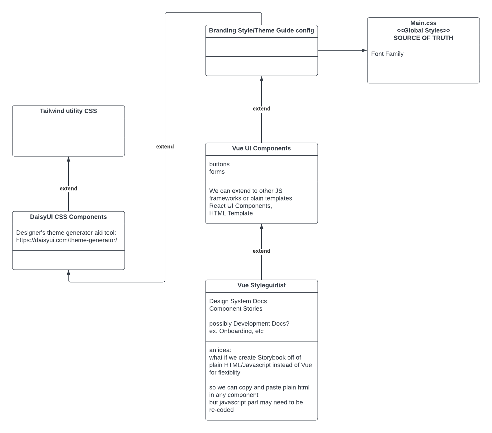

# uids
https://rlynjb.github.io/uids/

## Plan


## Project Setup and Configuration

1. install vue using vue-cli
follow vue styleguidist instruction here: https://vue-styleguidist.github.io/docs/GettingStarted.html#_1-install

2. install tailwindcss via vue-cli
- https://tailwindcss.com/docs/installation
- add to vue-cli: https://www.npmjs.com/package/vue-cli-plugin-tailwind

3. install typescript via vue-cli
- run `sudo vue add typescript`

4. install and configure daisyui
- https://daisyui.com/docs/install/

5. use https://heroicons.com/ for svg/jsx icons

## Start local dev
```
npm run styleguide
```

## Deploy to Github Pages
```
npm run cleanbuild
npm run styleguide:build
npm run movebuild
```

## Tasks:

### TODOs
- SelectMultipleFieldUI - set code snippets for remaining use case.
- StepsUI - use ref template to switch contents
- ~~TableUI - add code snippet for "Add buttons"; add code snippet for "Make a column sortable."~~
- TabsUI - use ref template to switch contents
- ToastUI - set code scnippets/usages
- Add a Chart/graph component using Pathfinder Visualization
- rewrite components to use vue3 setup. docs to document Events in vue3 - https://vue-styleguidist.github.io/docs/Documenting.html#setup-syntax

### Bugs
- template ref is not supported in vue-styleguidist - https://stackoverflow.com/questions/67033933/cant-use-template-ref-on-component-in-vue-3-composition-api#answers-header

### Backlog
- Set Vue-Styleguidist theme. Check is possible to re-layout pages
- Show component props section by default
- Show component view code by default
- set official UI styleguide name
- display components on each own page
- convert to react component
- create test
